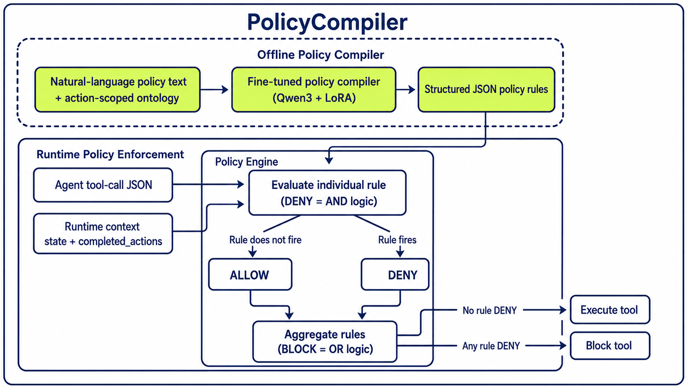

# PolicyCompiler

*A lightweight policy compiler for translating natural-language policies into executable structured JSON rules.*

Built for the **Nebius Serverless AI Builders Challenge** — track: *Fine-tuning pipelines*. The compiler is a **Qwen3 + LoRA** model fine-tuned with Nebius Serverless AI Jobs.

The entire pipeline is easy to reproduce on **Nebius Serverless AI** — the serverless GPU platform from our sponsor — where LoRA fine-tuning, and evaluation each run as a single job with no cluster to manage. See [**Fine-tune and evaluate on Nebius Serverless AI ↓**](#fine-tune-and-evaluate-on-nebius-serverless-ai) for the full runbook.

Agentic workflows often need to comply with complex organizational and domain-specific policies. Today, LLMs are frequently used as runtime guardrails, but relying on them for enforcement makes compliance decisions inherently probabilistic. An LLM may miss applicable constraints, fail to account for dependencies between policy rules, or produce inconsistent decisions for semantically equivalent inputs. Moreover, invoking an LLM for every policy check increases token usage, runtime latency, and inference cost.

In practice, many policies can be translated into structured rules and evaluated deterministically by a policy engine, without invoking an LLM for each runtime compliance check. This approach may reduce latency and cost while improving the consistency, reliability, and auditability of runtime enforcement.

Manually converting policies into structured rules is time-consuming and difficult to scale. This project fine-tunes a small language-model policy compiler which translates natural-language
policies into an executable JSON **rule schema** (called a **structured rule** in this project). Human reviewers can then validate, edit, and approve the generated rules before deployment. When policies are updated or new regulations are introduced, this model compiler-assisted workflow can benefit organizations through timely adapting to the new policy compliance requirements.

Our fine-tuned model serves as the core of the offline policy compiler shown in the three colored boxes. This project delivers the fine-tuned compiler and the deterministic engine (`check_action`) that executes the compiled rules — the engine is what produces the runtime-safety metrics reported below. It does not implement the full end-to-end agentic deployment (a live agent emitting tool calls, and the execute/block actuation); those parts of the figure illustrate how PolicyCompiler would be integrated and are left as future work.

<p align="center">
  
</p>

The held-out ground truth
([`policygraph/seeds/expense_management.json`](policygraph/seeds/expense_management.json)) contains
80 hand-authored expense-management policies, each with a gold structured JSON rule and annotated runtime
test cases. It also carries the action-scoped ontology and compatibility spec used by the pipeline.

---

## Contributions

- **Dataset and structured rule schema.** Designed a compact JSON **structured rule** schema (`target_action`
  + `deny_when`, with the fail-open-field / fail-closed-prerequisite asymmetry) and prepared the
  dataset — a seed-driven training set plus a hand-authored, held-out set of 80 policies with gold
  structured rules and annotated runtime cases that serves as the evaluation benchmark.
- **Evaluation methodology.** Designed a metrics system spanning compiler quality (schema / ontology
  / exact-match rate), runtime safety (unsafe-allow FN / over-deny FP), and latency (compile /
  engine), reported with Wilson 95% confidence intervals.
- **End-to-end pipeline.** Designed and ran the full pipeline — deterministic data generation → LoRA
  fine-tuning of Qwen3 → evaluation — as Nebius Serverless AI Jobs.
- **Insightful results.** An apple-to-apple base-vs-fine-tuned study: fine-tuning turns an unusable
  base into a working compiled guardrail; size differences among fine-tuned models stay within the
  confidence interval — data quality, not model scale, drives performance.
- **One domain, transferable pipeline.** Used expense management to demonstrate the benefit of
  fine-tuning a small language model for policy compliance; the same pipeline can be applied to other
  policy domains with domain-specific data.

---

## Results

All models are fine-tuned on the same audited training data and evaluated on the same 80 held-out
policies. Latency is measured on a Nebius H100.
Wilson 95% confidence intervals are reported in
[`policygraph/evaluation_metrics.md`](policygraph/evaluation_metrics.md).

Each cell is **base → fine-tuned**. Same base checkpoint, prompt, in-prompt ontology, greedy decoding, and scoring; the only difference is the LoRA adapter.

| <sub>Model</sub> | <sub>Schema&nbsp;validity&nbsp;↑</sub> | <sub>Ontology&nbsp;validity&nbsp;↑</sub> | <sub>Exact&#8209;match&nbsp;rate&nbsp;↑</sub> | <sub>Unsafe&#8209;allow&nbsp;(FN)&nbsp;↓</sub> | <sub>Over&#8209;deny&nbsp;(FP)&nbsp;↓</sub> | <sub>Compile&nbsp;latency&nbsp;p50&nbsp;(ms)&nbsp;↓</sub> | <sub>Engine&nbsp;latency&nbsp;p50&nbsp;(µs)&nbsp;↓</sub> |
|:---|:---:|:---:|:---:|:---:|:---:|:---:|:---:|
| <sub>Qwen3&#8209;0.6B</sub> | <sub>6.2%&nbsp;→&nbsp;96.2%</sub> | <sub>2.5%&nbsp;→&nbsp;87.5%</sub> | <sub>0.0%&nbsp;→&nbsp;68.8%</sub> | <sub>95.2%&nbsp;→&nbsp;26.5%</sub> | <sub>0.0%&nbsp;→&nbsp;2.5%</sub> | <sub>3350&nbsp;→&nbsp;1736</sub> | <sub>1.66&nbsp;→&nbsp;1.49</sub> |
| <sub>Qwen3&#8209;1.7B</sub> | <sub>8.8%&nbsp;→&nbsp;100%</sub> | <sub>6.2%&nbsp;→&nbsp;98.8%</sub> | <sub>3.8%&nbsp;→&nbsp;88.8%</sub> | <sub>94.0%&nbsp;→&nbsp;10.8%</sub> | <sub>0.8%&nbsp;→&nbsp;0.0%</sub> | <sub>1363&nbsp;→&nbsp;1594</sub> | <sub>1.72&nbsp;→&nbsp;1.58</sub> |
| <sub>Qwen3&#8209;4B</sub> | <sub>18.8%&nbsp;→&nbsp;100%</sub> | <sub>17.5%&nbsp;→&nbsp;98.8%</sub> | <sub>13.8%&nbsp;→&nbsp;88.8%</sub> | <sub>84.3%&nbsp;→&nbsp;9.6%</sub> | <sub>0.0%&nbsp;→&nbsp;0.8%</sub> | <sub>2004&nbsp;→&nbsp;2107</sub> | <sub>1.65&nbsp;→&nbsp;1.52</sub> |

### Metric definitions

1. **Compiler quality** is reported as a three-stage funnel, with each stage applying a stricter
   criterion to the predicted JSON policy rules:
   - **Schema validity** — proportion of held-out policies whose model output parses into a
     well-formed `RuleGraph`.
   - **Ontology validity** — proportion of held-out policies whose predicted rules have every
     reference (target action, field, value, prerequisite) canonical in the action-scoped ontology.
   - **Exact-match rate** — proportion of held-out policies whose predicted JSON policy rules are
     identical to gold: the target action plus the full set of `deny_when` conditions (field,
     operator, value, or prerequisite), order-insensitive.

2. **Runtime safety**
   A policy enforcement guardrail can fail two ways: allow a tool that violates the policy, and deny a tool which does not violate the policy. We measure both failures, and both metrics are computed over the 205 runtime cases (83 gold-DENY, 122 gold-ALLOW); lower is better on both.
   - **Unsafe-allow rate (false negative)** is the primary safety metric. Among runtime cases whose gold decision is
   **DENY**, it measures how often the compiled rule incorrectly permits the tool call. Lower is
   better.

      ```text
      unsafe-allow rate = (# gold-DENY cases predicted ALLOW) / (# gold-DENY cases)
      ```
   - **Over-deny rate (false positive)** is the counterpart availability metric. Among runtime cases
   whose gold decision is **ALLOW**, it measures how often the compiled rule incorrectly denies the
   tool call. Reporting it beside unsafe-allow shows a low unsafe-allow rate is not achieved by
   simply denying everything. Lower is better.

      ```text
      over-deny rate = (# gold-ALLOW cases predicted DENY) / (# gold-ALLOW cases)
      ```

3. **Compile latency p50** is the median wall-clock time for the fine-tuned model to compile one
   natural-language policy into a structured JSON rule, measured on a Nebius H100 (batch size 1, greedy
   decoding), in **milliseconds per policy**. It is a one-off, **offline** cost paid once per policy
   at authoring time — not on every request.

4. **Engine latency p50** is the median wall-clock time for the deterministic Python engine
   (`check_action`) to evaluate one proposed agent tool call against a compiled structured rule and return
   an ALLOW/DENY decision, in **microseconds per decision**. It is the **online**, per-tool-call
   enforcement cost — CPU-bound, with no model in the loop, so it is model-independent.

Because the held-out set is small, we report Wilson 95% confidence intervals and do not claim a firm
ranking among fine-tuned model sizes. We focus on small, single-GPU-trainable models (0.6B–4B). We
also fine-tuned and evaluated 8B and found no further improvement over 4B (the difference is within
the confidence interval): our dataset is limited in scope and well-matched to smaller models, so the
scaling effect is not significant — **data quality, not scale, is the bottleneck**. Run receipts are
in [`policygraph/nebius_runs.md`](policygraph/nebius_runs.md).

**Fine-tuning is the difference between unusable base models and a working compiled guardrail** — it
takes the same checkpoints from 84–95% unsafe-allow and near-zero valid rules to a deployable,
deterministic compiler.

---

## How PolicyCompiler represents a policy

Each structured JSON rule specifies the target action (a tool call) and a set of `deny_when` rules. A rule denies
the target action when all conditions under the `deny_when` list hold: **state is satisfied**,
the required action has **not been completed**. A deterministic policy
engine then evaluates a proposed agent tool call and runtime cases (`state fields` and
`prerequisite_actions`) against the structured rule to produce an **ALLOW** or **DENY** decision for
policy-compliance enforcement.

Held-out policy `expense_058`:

> *"A reimbursement for a flight booked fewer than 14 days before departure may not be issued unless
> business justification has been documented."*

Compiled structured rule:

```json
{
  "domain": "expense_management",
  "rules": [{
    "target_action": "issue_reimbursement",
    "deny_when": [
      {"field": "booking_lead_days", "operator": "<", "value": 14},
      {"not_completed": "business_justification"}
    ]
  }]
}
```

How to read it:

- `target_action` identifies the governed tool call (`issue_reimbursement`).
- `deny_when` is an AND condition: this rule denies the reimbursement only when the flight was booked
  fewer than 14 days before departure (`booking_lead_days < 14`) **and** a business justification has
  not been completed.
- `{field, operator, value}` reads from the `state` in the runtime cases — here a numeric comparison.
- `{not_completed: name}` reads from `completed_actions` in the runtime cases.

Runtime behavior — each case is a proposed tool call plus its runtime context (`completed_actions`
and `state`), paired with a gold `decision`. Runtime cases are evaluation-only (never model input or
output); the engine runs the compiled structured rule against each and compares its verdict to the gold:

| Runtime case (engine input, JSON) | Gold | Why |
|---|---|---|
| `{"completed_actions": [], "state": {"booking_lead_days": 10}, "proposed_action": {"name": "issue_reimbursement"}}` | **DENY** | `< 14` days *and* justification missing → both `deny_when` conditions hold → rule fires |
| `{"completed_actions": ["business_justification"], "state": {"booking_lead_days": 10}, "proposed_action": {"name": "issue_reimbursement"}}` | **ALLOW** | justification completed → `not_completed` is false → AND breaks |
| `{"completed_actions": [], "state": {"booking_lead_days": 20}, "proposed_action": {"name": "issue_reimbursement"}}` | **ALLOW** | `20 < 14` is false → numeric condition does not hold |
| `{"completed_actions": [], "state": {"booking_lead_days": 14}, "proposed_action": {"name": "issue_reimbursement"}}` | **ALLOW** | boundary: `14 < 14` is false (strict `<`) → rule does not fire |
| `{"completed_actions": [], "state": {}, "proposed_action": {"name": "issue_reimbursement"}}` | **ALLOW** | `booking_lead_days` absent → field condition can't hold → rule silent (fail-open) |

The important asymmetry is:

| Missing input | Engine behavior | Why |
|---|---|---|
| field absent from `state` | rule stays silent → fail-open | the rule cannot speak to a fact it was not given |
| prerequisite absent from `completed_actions` | rule fires → fail-closed | a missing required step should block |

This evaluation assumes the runtime context is complete and trustworthy — it runs the compiled rules
directly against the annotated `state` / `completed_actions` and does not validate state completeness.
Because the engine **fail-opens on an absent field**, a production deployment should add an
attribute-resolution / completeness-validation layer before the engine, so a missing-but-required fact
never silently permits. See
[`evaluation_metrics.md`](policygraph/evaluation_metrics.md#runtime-completeness-a-production-caveat)
for when an absent field is benign versus a failure, and how to harden it.

---

## Repo layout

```text
policygraph/
├── src/
│   ├── schemas.py
│   └── rule_engine.py
├── seeds/
│   └── expense_management.json
├── tools/
│   ├── seed.py
│   ├── coverage.json
│   ├── generate.py
│   └── build_seeds.py
├── eval/
│   └── run_eval.py
├── dataset/
├── seeds_eval/
├── evaluation_metrics.md
├── METRIC_COMPUTATION.md
└── nebius/
    ├── config_qwen3_0p6b.yaml
    ├── config_qwen3_1p7b.yaml
    ├── config_qwen3_4b.yaml
    ├── config_qwen3_8b.yaml
    └── bench_compile.py
```

---

## Setup

Requires **Python 3.11**.

```bash
cd policygraph
pip install pydantic
pip install "transformers>=4.51" torch peft
```

The first command is enough for the deterministic engine, generator, and selftest. The ML
dependencies are needed only to run a trained Qwen3 adapter.

---

## Reproduce locally

Regenerate the held-out eval inputs:

```bash
cd policygraph
python3 tools/build_seeds.py
```

The committed training set (`dataset/train.jsonl`, **978 examples**) is a seed-driven base
(`generate.py --seed 7`, 779 rows) augmented with targeted hard-negative examples that reinforce
minimal, well-grounded rules; train a per-size config (below) on it to reproduce the reported
results. `build_seeds.py` regenerates the 80 held-out eval inputs deterministically.

Verify the eval harness without a model:

```bash
python3 -m eval.run_eval --selftest
```

Evaluate a trained adapter:

```bash
python3 -m eval.run_eval --adapter <adapter_dir> --base-model Qwen/Qwen3-4B-Base \
  --train-data dataset --latency --dump eval.json
```

---

## Fine-tune and evaluate on Nebius Serverless AI

Training and evaluation both run as **Nebius Serverless AI Jobs** on the public Axolotl image.
Training data, configs, LoRA adapters, and evaluation dumps all live in Nebius Object Storage.

Run receipts are recorded in [`policygraph/nebius_runs.md`](policygraph/nebius_runs.md).

All four sizes were fine-tuned on a **Nebius H100** (`gpu-h100-sxm`) so the compile-latency numbers
stay comparable across sizes. Real training job IDs:

| Model | Config | Platform | Training job ID |
|---|---|---|---|
| Qwen3-0.6B | `config_qwen3_0p6b.yaml` | `gpu-h100-sxm` | `aijob-e00jnbsgtambhrrevw` |
| Qwen3-1.7B | `config_qwen3_1p7b.yaml` | `gpu-h100-sxm` | `aijob-e00fsjwct51syq236g` |
| Qwen3-4B | `config_qwen3_4b.yaml` | `gpu-h100-sxm` | `aijob-e00yha3npja2zyaks1` |
| Qwen3-8B (evaluated, no further gain) | `config_qwen3_8b.yaml` | `gpu-h100-sxm` | `aijob-e00h3455kqn4pcenz6` |

The 8B fine-tune completes in a few minutes on a single H100. Eval job IDs and result dumps are in the run receipts
linked above. The smaller models also fit on cheaper L40S when cross-size latency comparability is
not needed.

Upload data and configs:

```bash
aws s3 cp policygraph/dataset/train.jsonl s3://fine-tuning-axolotl/dataset/train.jsonl --endpoint-url https://storage.eu-north1.nebius.cloud

for c in 0p6b 1p7b 4b 8b; do
  aws s3 cp policygraph/nebius/config_qwen3_${c}.yaml \
    s3://fine-tuning-axolotl/config_qwen3_${c}.yaml \
    --endpoint-url https://storage.eu-north1.nebius.cloud
done
```

Submit the Qwen3-8B job:

```bash
nebius ai job create --name "pg-qwen3-8b" \
  --subnet-id "vpcsubnet-XXXXXXXX" \
  --image docker.io/axolotlai/axolotl:main-20260309-py3.11-cu128-2.9.1 \
  --platform gpu-h100-sxm --preset 1gpu-16vcpu-200gb --disk-size 450Gi \
  --volume "storagebucket-XXXXXXXX:/workspace/data" \
  --container-command bash \
  --args '-c "RUN_ID=run-qwen3-8b-$(date +%Y%m%d-%H%M%S); axolotl train /workspace/data/config_qwen3_8b.yaml && mkdir -p /workspace/data/output/$RUN_ID && cp -r /workspace/output/. /workspace/data/output/$RUN_ID"'
```

Qwen3 requires `transformers >= 4.51`; confirm the job log shows a training `loss` line before
launching the remaining sizes.

**Evaluation runs as a Nebius Job too.** The same `run_eval` harness runs on a Nebius H100 with
`--latency`, so the compile-latency figures in the [Results](#results) table are real measurements
on Nebius hardware, not local timings. Both the fine-tuned adapters and the untuned base
checkpoints are evaluated apple-to-apple this way; the evaluation job IDs and result dumps are
recorded in [`policygraph/nebius_runs.md`](policygraph/nebius_runs.md).

---

## Data

PolicyCompiler is trained on synthetic but audited policy-compilation examples. Each example pairs a
natural-language policy with a canonical structured JSON rule generated from the action-scoped ontology
and rule schema. The examples are constructed to teach the model how policy wording maps to the
canonical actions, fields, values, and prerequisite steps used by the structured rule.

The synthetic training set is logically audited against the rule schema and policy engine: generated
gold rules are valid, canonical, and executable. However, it is still a controlled MVP dataset, not
a full production corpus of professionally authored enterprise policies. Its policy language is
designed to teach the compiler the target schema and grounding behavior; richer domain-authored
policy data would likely improve real-world semantic coverage and generalization.

Evaluation uses a separate held-out set of 80 hand-authored expense-management policies with
hand-annotated gold structured rules and 205 runtime test cases. Held-out policy texts and examples are
excluded from training to prevent direct leakage or memorization of evaluation answers; the ontology
and schema are shared, as they define the executable target language.

---

## Related work

**Policy-as-code engines.**

- [Open Policy Agent (OPA) / Rego](https://www.openpolicyagent.org/)
- Cutler et al. *Cedar: A New Language for Expressive, Fast, Safe, and Analyzable Authorization.*
  PACMPL (OOPSLA), 2024. [arXiv:2403.04651](https://arxiv.org/abs/2403.04651) ·
  [cedar-policy/cedar](https://github.com/cedar-policy/cedar)

**LLM policy compilation.**

- Gupta & Sreenivasamurthy. *Prose2Policy (P2P): A Practical LLM Pipeline for Translating
  Natural-Language Access Policies into Executable Rego.* 2026.
  [arXiv:2603.15799](https://arxiv.org/abs/2603.15799)

**Agent guardrails.**

- Anthropic. *Building Effective Agents.* 2024.
  [anthropic.com/engineering/building-effective-agents](https://www.anthropic.com/engineering/building-effective-agents)

---

## More details

- Metric definitions: [`policygraph/evaluation_metrics.md`](policygraph/evaluation_metrics.md)
- Metric code map: [`policygraph/METRIC_COMPUTATION.md`](policygraph/METRIC_COMPUTATION.md)
- Nebius run receipts: [`policygraph/nebius_runs.md`](policygraph/nebius_runs.md)

---

## Scope and limitations

This project uses expense-management policies as a running example. The fine-tuned model is
specialized for the policy data and ontology in this repository and is intended to demonstrate how a
small language model can be fine-tuned with Nebius Serverless AI to support policy-compilation tasks
for enterprise compliance. This fine-tuned small language model should not be assumed to generalize
across policy domains without domain-specific data and training. However, practitioners can follow a
similar data-preparation and fine-tuning pipeline on Nebius Serverless AI for other policy domains.

---

## License

MIT — see [`LICENSE`](LICENSE).
